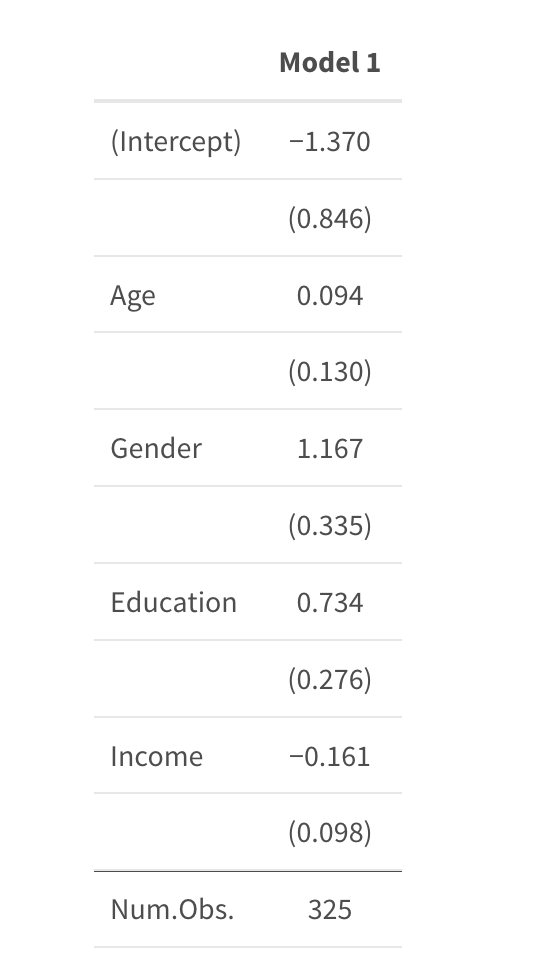

```{r setup, include = FALSE}
# Import all necessary libraries
knitr::opts_chunk$set(echo = TRUE)
library(modelsummary)
library(tidyverse)
library(palmerpenguins)
library(kableExtra)
library(here)
library(dplyr)
library(tidyr)
library(ggplot2)
library(readxl)
library(plotrix)
library(gt)
# Read the dataset, use here to navigate to working directory
global_avg_temperature <- read_csv(here::here("inputs/data/GlobalTemperatures.csv"))

climate_perception <- read_csv(here::here("inputs/data/survey.csv"))
```


# Introduction

Ever since Industrial Revolution, people's life has become more and more convenient, for example, the invention of the steam engine made transportation much more easier. However, this convenience comes with great drawbacks, over the entire industrial revolution, scientist estimated that a total of 2.3 trillion tonnes of Carbon Dioxide have been released into the atmosphere, what is even worse is that those Carbon Dioxide has a life span of 300 - 1000 years, this means that those climate change can happen on the time scale of many generations' lives. The reason those green house gases cause global warming is because they will reflect the heat radiated from Earths' surface back, thus making the Earth warmer. Figure \@ref(fig:land-average-temperature) shows the average land temperature on Earth in the past 100 years, Figure \@ref(fig:ocean-average-temperature) shows the average Ocean temperature on Earth in the past 100 years, the data are obtained from Berkeley Earth Data Portal [@berkeleyearth].

```{r land-average-temperature, fig.cap='Land Average Temperature', echo=FALSE, warning=FALSE, message = FALSE, fig.width=5, fig.height=3, fig.pos = "!H"}
# Part of the below code are from https://www.kaggle.com/code/jagelves/continental-us-climate-change-1850-2013/report?scriptVersionId=0
cleaned_avg_temp <- global_avg_temperature %>%
  separate(col = dt, into = c("Year", "Month", "Day"), convert = TRUE)
cleaned_avg_temp <- na.omit(cleaned_avg_temp)

Land_Avg_sum <- cleaned_avg_temp %>% 
  filter(Year>1850) %>%
  group_by(Year) %>% 
  summarise(AverageTemperature = mean(LandAverageTemperature))

qplot(Year, AverageTemperature, data=Land_Avg_sum, main="Land Average Temperature 1850-2013",geom=c("point","smooth"))+ aes(colour = AverageTemperature) + scale_color_gradient(low="blue", high="red")

```

```{r ocean-average-temperature, fig.cap='Ocean Average Temperature', echo=FALSE, warning=FALSE, message = FALSE, fig.width=5, fig.height=3, fig.pos = "!H"}
# Part of the below code are from https://www.kaggle.com/code/jagelves/continental-us-climate-change-1850-2013/report?scriptVersionId=0
cleaned_avg_temp <- global_avg_temperature %>%
  separate(col = dt, into = c("Year", "Month", "Day"), convert = TRUE)
cleaned_avg_temp <- na.omit(cleaned_avg_temp)

Land_Avg_sum <- cleaned_avg_temp %>% 
  filter(Year>1850) %>%
  group_by(Year) %>% 
  summarise(AverageTemperature = mean(LandAverageTemperature))

qplot(Year, AverageTemperature, data=Land_Avg_sum, main="Ocean Average Temperature 1850-2013",geom=c("point","smooth"))+ aes(colour = AverageTemperature) + scale_color_gradient(low="blue", high="red")

```

From the above two figures, it is very clear that the Earth's temperature is increasing rapidly after the Industrial Revolution. Based on research, Earth's temperature has risen by 0.08 Celsius per decade since 1880, and the rate of warming over the past 40 years is more than twice of that, 0.18 Celsius per decade. People might develop the illusion that because this looks like a very small increase, it will have little or no impact on Earth's environment. However, this is wrong, the total volume of the Ocean on Earth is around 1.335 billion cubic kilometers, therefore, a tremendous amount of energy is required to heat up the ocean [@dahlman].

Global warming has been regarded as a high-risk problem globally because it will trigger a chain of events. For instance, the increased temperature will melt polar ice caps, then those ice water will be released into the ocean, causing the global sea level to rise. This could trigger a series of events, for example, the salinity of the ocean will decrease because of this large amount of fresh water, and the decreased salinity is deleterious for certain species such as coral reef, which is a keystone species, meaning its extinction is disastrous to the entire ecosystem. Moreover, the melting of the polar ice cap will reveal the black soil under it, those black soil will then absorb more energy from the sun, thus exacerbating global warming.

Luckily, hundreds of nations are actively trying to fight Climate Change, some are planting more trees so that the excessive Carbon Dioxide can be absorbed through Photosynthesis, and some are developing more sustainable and environment-free energy sources such as solar power. Toronto, for example, proposed an ambitious plan called TransformTO, its goal is to achieve net-zero greenhouse gas emissions. However, everyone has a different level of education, hence it is common for people to hold different opinions about climate change. It is reasonable to believe that a university student majoring in environmental science will be more concerned about global warming than someone with high school education. To find out if there is a relationship between people's perception of climate change and their demographic factors such as income, level of education, and age, we obtained a city-wide climate perception survey dataset from the City of Toronto Data Portal [@opendatator]. On top of that, the report written by the City of Toronto was also helpful [@report].


# Data
We started our data analysis by using R [@citeR], dplyr[@dplyr], tidyverse[@tidyverse], here[@here]. Graphs are generated using ggplot2[@ggplot2], kableExtra[@kableExtra], and gridExtra[@gridExtra].

## Data Source and Collection
The dataset I will be using are from the City of Toronto Data Portal, it is conducted city-wide to gather people's opinion on climate change [@opendatator], the goal of this survey is to capture their perceptions about climate change and to estimate people's willingness to take actions and help the city government to establish the goal of achieving net-zero carbon dioxide emission. The survey is conducted online and a total of 404 results were received between October 11 to October 18, 2018. All survey respondents are adult residents living in the City of Toronto. 

## Data Overview
All respondents are from 4 geological areas: Etobicoke-York, North York, Scarborough, and Toronto and East York, Figure \@ref(fig:respondents-number) is a bar graph showing the number of respondents from each area. Other than coming from different city areas, respondents also have different demographic backgrounds, For instance, some respondents have a household income of more than $150000 while some respondents only have a household income lower than $40000. The respondents also have a big age variety with some people being 65 years old and some only 20 years old. Below are some figures showing the distribution of the respondents based on their demographic factors. Figure \@ref(fig:agesum) shows the distributions of respondents based on their age, Figure \@ref(fig:incomesum) shows the distribution of respondents based on their household income. Finally, Figure \@ref(fig:edulevel) shows the distribution of respondents based on their level of education.


```{r respondents-number, fig.cap='Number of Respondents from Each Area', echo=FALSE, warning=FALSE, message = FALSE, fig.width=5, fig.height=2.5, fig.pos = "!H"}
number_from_each_area <- c(99, 101, 91, 113)
area_name <- c("Etobicoke-York", "North York", "Scarborough", "Toronto and East York")
ggplot() + geom_bar(aes(x=area_name,y=number_from_each_area), stat='identity') + xlab('Area') + ylab('Number of Respondents')
```

```{r agesum, fig.cap='Number of Respondents Based on Age', echo=FALSE, warning=FALSE, message = FALSE, fig.width=5, fig.height=3, fig.pos = "!H"}

# Below we will find the age distribution of all the respondents

age_of_all_respondents <- climate_perception %>% filter(`HIDAGE1` != 'NA');
age_of_all_respondents <- age_of_all_respondents["HIDAGE1"]
age_group <- age_of_all_respondents %>% mutate(cuts = cut(HIDAGE1, c(17, 25, 40, 55, 65, 150))) %>% 
  group_by(cuts) %>% 
  summarize(n=n())


levels(age_group$cuts) <- c("18 to 25", "25 to 40", "40 to 55", "55 to 65", "65+")

ggplot(data=age_group, aes(x = reorder(`cuts`, n), y=n)) +
  geom_bar(stat="identity", position=position_dodge()) + coord_flip() + xlab('Area') + ylab('Age Range')

```

```{r incomesum, fig.cap='Number of Respondents Based on Household Income', echo=FALSE, warning=FALSE, message = FALSE, fig.width=4, fig.height=4}

# Below we will find the income distribution of all the respondents

income_of_all_respondents <- climate_perception %>% filter(`QD6` != 'Prefer not to answer');
income_of_all_respondents <- income_of_all_respondents["QD6"]

respondents_grouped_by_income <-
  group_by(income_of_all_respondents, `QD6`) %>%
  summarize(n())

names(respondents_grouped_by_income)[names(respondents_grouped_by_income) == 'n()'] <- 'n'

ggplot(data=respondents_grouped_by_income, aes(x = reorder(`QD6`, n), y=n)) +
  geom_bar(stat="identity", position=position_dodge()) + coord_flip() + xlab('Household Income') + ylab('Number of Respondents')
```


```{r edulevel, fig.cap='Number of Respondents Based on level of education', echo=FALSE, warning=FALSE, message = FALSE, fig.width=5, fig.height=4, fig.pos = "!H"}

# Below we will find the education distribution of all the respondents

education_of_all_respondents <- climate_perception["QD5"]

respondents_grouped_by_education <-
  group_by(education_of_all_respondents, `QD5`) %>%
  summarize(n())

names(respondents_grouped_by_education)[names(respondents_grouped_by_education) == 'n()'] <- 'n'
names(respondents_grouped_by_education)[names(respondents_grouped_by_education) == 'QD5'] <- 'Education Level'

ggplot(data=respondents_grouped_by_education, aes(x ='', y=n, fill = `Education Level`))  + geom_bar(stat = "Identity", width = 4, color = "Yellow") + coord_polar("y", start = 0) + theme_void()
```


\newpage
# Models

Since our goal is to find out the impacts of demographic factors such as age, gender, income and education on one's awareness of global climate change. We will build a statistical model which takes those demographic factor as input, and output a binary variable indicating if this person will be concerned about climate change. The model will behave like the following where $\alpha_i$ denotes the $i^{th}$ demographic factor.

$$f(\alpha_0, \alpha_1, \alpha_2, \alpha_3 ...) = 0\;or\;1$$


## Logistic Regresssion

Logistic regression is used when the dependent variable (target variable) is categorical, this fits perfectly here because our target variable is either *Concerned about Climate Change* or *Not Concerned about Climate Change*. Logistic regression is very similar to the traditional linear regression but it uses the regression formula inside the logistic function of ${\frac{e^x} {(1 + e^x)}}$, so it has the following form.

$$P = {\frac{e^{(\beta_0 + \beta_1X_1)}}{1 + e^{(\beta_0 + \beta_1X_1)}}}$$
However, in our case, since we have several independent variables, we can instead use Multiple Logistic Regression, it has the following form

$$P = {\frac{e^{(\beta_0 + \beta_1X_1 + \beta_2X_2 + \beta_3X_3 + ... + \beta_iX_i)}}{1 + e^{(\beta_0 + \beta_1X_1 + \beta_2X_2 + \beta_3X_3 + ... + \beta_iX_i)}}}$$


## Independent Variables

For our statistical model, we will try to predict whether a person will be concerned with climate change using 4 demographic factors: Age, Gender, Income, and Level of Education.

### Age

We will investigate on whether a person's age has any effects on shaping his/her view on the global climate change.

### Gender

Because the vast majority respondents' gender is male or female. We will neglect other gender in this paper. Because gender is used as an input to the logistic regression model, we will use 1 to represent Male and 2 to represent Female.

### Income

The survey divides people's household income into 4 subgroups: *Under $40,000*, *$40,001 to $60,000*, *$60,001 to $80,000*, *$80,001 to $100,000*, *$100,001 to $150,000*, *More than $150,000*. We will use *$30000*, *$50000*, *$70000*, *$90000*, *$125000*, *$200000* to represent them respectively.\

### Level of Education

We will divide people's level of education into 3 groups: *High School or Less*, *Undergraduate Degree*, *Post Graduate Degree/Professional School*. We will use number 1 to 3 to represent each one of them respectively.

Above is a summary of the model and indepedent variables we will be using, more details will be presented in the Results section.

# Results

We will first talk about each independent variable in more detail.

## Relationship between People's Awareness of Climate Change and Various Demographic Factors

Our ultimate goal is to develop a statistical model which takes a person's demographic factor as input, and try to predict whether that person will be concerned about global climate change. To do this, we will take a look at different demographic factors, and determine their impacts in the model.

### Age

Although it is a consensus that global climate change is a problem that needs to be addressed, people from different age groups might view it differently. Based on research conducted by the Pew Research Center [@ageper], scientists found out that Gen Z (Born after 1996) and Millennials (Born between 1981 and 1996) are usually more concerned about global climate change than the older generations. There are several reasons for this, for example, these generations generally have more access to the internet, which means they are seeing a lot of climate change content online.

We will now take a look at our survey results and determine whether age is a relevant factor. The second question in the survey is "For each of the following, how concerned are you about climate change?", the respondents can choose one from the following: "Extremely concerned, Very concerned, Not very concerned, Not at all concerned, Don’t know". For simplicity, we will group *Extremely concerned* and *Very concerned* into a big category called *Concerned*, and we will group *Not very concerned* and *Not at all concerned* into a big category called *Not Concerned*, we will neglect *Don't know* answers. Table \@ref(tab:ageconcern) is a summary table. However, the table suggests something different, we can see that people who is older than 65 years old are much more concerned about climate change than the younger generations. 

```{r ageconcern, fig.cap='Concern about Climate Change Based on Age Group', echo=FALSE, warning=FALSE, message = FALSE, fig.width=5, fig.height=4, fig.pos = "!H"}
age_relevant_data <- subset(climate_perception, select = c(`HIDAGE1`, `Q1r1`))
names(age_relevant_data)[names(age_relevant_data) == 'HIDAGE1'] <- 'Age'
names(age_relevant_data)[names(age_relevant_data) == 'Q1r1'] <- 'Concern'

age_relevant_data <- age_relevant_data %>% filter(!str_detect(Concern, "D"))

age_relevant_data$`Concern`[age_relevant_data$`Concern`=="Extremely concerned"] <- "Concerned"
age_relevant_data$`Concern`[age_relevant_data$`Concern`=="Very concerned"] <- "Concerned"

age_relevant_data$`Concern`[age_relevant_data$`Concern`=="Not very concerned"] <- "Not Concerned"
age_relevant_data$`Concern`[age_relevant_data$`Concern`=="Not at all concerned"] <- "Not Concerned"


final_age_relevant_data <- age_relevant_data %>% mutate(cuts = cut(Age, c(17, 25, 40, 55, 65, 150))) %>% group_by(cuts, Concern) %>% 
  summarize(n=n())

final_age_relevant_data <- group_by(final_age_relevant_data, cuts) %>% transmute(Concern, percent = round(n/sum(n),2 ))

levels(final_age_relevant_data$cuts) <- c("18 to 25", "25 to 40", "40 to 55", "55 to 65", "65+") 

final_age_relevant_data %>%
  knitr::kable(caption = "Concern about Climate Change Based on Age Group",
               col.names = c("Age Group", "Cocern Level", "Percentage WRT Age Group"),
               align = c('l', 'l', 'l'),
               booktabs = T) %>%
  kable_styling(full_width = T, latex_options = "hold_position")
```

### Household income

We will also take a look at how household income affect people's opinion on global climate change. In this survey, income are separated into 6 different categories: *Under $40,000*, *$40,001 to $60,000*, *$60,001 to $80,000*, *$80,001 to $100,000*, *$100,001 to $150,000*, *More than $150,000*. Because this will be used as an input to the statistical model, we will simplify those ranges by taking its median, therefore, those range will become: *$30000*, *$50000*, *$70000*, *$90000*, *$125000*, *$200000*. (The Under 50000 and over 150000 are slightly adjusted). Table \@ref(tab:incomeconcern) is a summary table. From the table, residents that are most concerned about climate change are people with household income between 80K and 100K.

```{r incomeconcern, fig.cap='Concern about Climate Change Based on Household Income', echo=FALSE, warning=FALSE, message = FALSE, fig.width=5, fig.height=4, fig.pos = "!H"}
income_relevant_data <- subset(climate_perception, select = c(`QD6`, `Q1r1`))
names(income_relevant_data)[names(income_relevant_data) == 'QD6'] <- 'Household Income'
names(income_relevant_data)[names(income_relevant_data) == 'Q1r1'] <- 'Concern'

income_relevant_data <- income_relevant_data %>% filter(!str_detect(`Household Income`, "P"))
income_relevant_data <- income_relevant_data %>% filter(!str_detect(`Concern`, "D"))

income_relevant_data$`Concern`[income_relevant_data$`Concern`=="Extremely concerned"] <- "Concerned"
income_relevant_data$`Concern`[income_relevant_data$`Concern`=="Very concerned"] <- "Concerned"

income_relevant_data$`Concern`[income_relevant_data$`Concern`=="Not very concerned"] <- "Not Concerned"
income_relevant_data$`Concern`[income_relevant_data$`Concern`=="Not at all concerned"] <- "Not Concerned"

income_relevant_data$`Household Income`[income_relevant_data$`Household Income`=="Under $40,000"] <- 30000
income_relevant_data$`Household Income`[income_relevant_data$`Household Income`=="$100,001 to $150,000"] <- 125000
income_relevant_data$`Household Income`[income_relevant_data$`Household Income`=="More than $150,000"] <- 200000
income_relevant_data$`Household Income`[income_relevant_data$`Household Income`=="$40,001 to $60,000"] <- 50000
income_relevant_data$`Household Income`[income_relevant_data$`Household Income`=="$80,001 to $100,000"] <- 90000
income_relevant_data$`Household Income`[income_relevant_data$`Household Income`=="$60,001 to $80,000"] <- 70000

final_income_relevant_data <- income_relevant_data %>% group_by(`Household Income`, `Concern`) %>% 
    summarize(n=n())


final_income_relevant_data <- group_by(final_income_relevant_data, `Household Income`) %>% transmute(Concern, percent = round(n/sum(n),2))


final_income_relevant_data %>%
  knitr::kable(caption = "Concern about Climate Change Based on Household income",
               col.names = c("Household Income", "Cocern Level", "Percentage WRT Household Income"),
               align = c('l', 'l', 'l'),
               booktabs = T) %>%
  kable_styling(full_width = T, latex_options = "hold_position")
```

### Gender

We will now take a look at how people's gender affect their opinion on global climate change. The survey provides 5 options: *Woman*, *Man*, *Transgender*, *Prefer not to say*, *Not listed above*, since the vast majority respondents indicated their gender to be either *Man* or *Woman*, we will neglect the rest. For simplicity, we will use 1 to represent Male and 2 to represent Female. Table \@ref(tab:genderconcern) is a summary table. From the results, we can see that female are usually more concerned about climate change than males.

```{r genderconcern, fig.cap='Concern about Climate Change Based on Gender', echo=FALSE, warning=FALSE, message = FALSE, fig.width=5, fig.height=4, fig.pos = "!H"}

gender_relevant_data <- subset(climate_perception, select = c(`QS2`, `Q1r1`))
names(gender_relevant_data)[names(gender_relevant_data) == 'QS2'] <- 'Gender'
names(gender_relevant_data)[names(gender_relevant_data) == 'Q1r1'] <- 'Concern'

gender_relevant_data <- gender_relevant_data %>% filter(!str_detect(`Concern`, "D"))
gender_relevant_data <- gender_relevant_data %>% filter(!str_detect(`Gender`, "P"))
gender_relevant_data <- gender_relevant_data %>% filter(!str_detect(`Gender`, "T"))

gender_relevant_data$`Concern`[gender_relevant_data$`Concern`=="Extremely concerned"] <- "Concerned"
gender_relevant_data$`Concern`[gender_relevant_data$`Concern`=="Very concerned"] <- "Concerned"

gender_relevant_data$`Concern`[gender_relevant_data$`Concern`=="Not very concerned"] <- "Not Concerned"
gender_relevant_data$`Concern`[gender_relevant_data$`Concern`=="Not at all concerned"] <- "Not Concerned"

gender_relevant_data$`Gender`[gender_relevant_data$`Gender` == "Man"] <- 1
gender_relevant_data$`Gender`[gender_relevant_data$`Gender` == "Woman"] <- 2

final_gender_relevant_data <- gender_relevant_data %>% group_by(`Gender`, `Concern`) %>% 
    summarize(n=n())


final_gender_relevant_data <- group_by(final_gender_relevant_data, `Gender`) %>% transmute(Concern, percent = round(n/sum(n),2))


final_gender_relevant_data %>%
  knitr::kable(caption = "Concern about Climate Change Based on Gender",
               col.names = c("Gender", "Cocern Level", "Percentage WRT Gender"),
               align = c('l', 'l', 'l'),
               booktabs = T) %>%
  kable_styling(full_width = T, latex_options = "hold_position")
```

### Level of Education

Finally, we will look at the effect of education on people's awareness of climate change. There are 6 valid responses, for simplicity, we categorize them into 3 groups: *High School or Less*, *Undergraduate Degree*, *Post Graduate Degree/Professional School*, we will label them from 1-3 respectively. Table \@ref(tab:educoncern) is a summary table.
From the table, clearly people with a higher level of education are usually more concerned with the climate change.

```{r educoncern, fig.cap='Concern about Climate Change Based on Level of Education', echo=FALSE, warning=FALSE, message = FALSE, fig.width=5, fig.height=4, fig.pos = "!H"}
edu_relevant_data <- subset(climate_perception, select = c(`QD5`, `Q1r1`))
names(edu_relevant_data)[names(edu_relevant_data) == 'QD5'] <- 'Education'
names(edu_relevant_data)[names(edu_relevant_data) == 'Q1r1'] <- 'Concern'

edu_relevant_data <- edu_relevant_data %>% filter(!str_detect(`Education`, "Prefer not to answer"))
edu_relevant_data <- edu_relevant_data %>% filter(!str_detect(`Concern`, "D"))

edu_relevant_data$`Concern`[edu_relevant_data$`Concern`=="Extremely concerned"] <- "Concerned"
edu_relevant_data$`Concern`[edu_relevant_data$`Concern`=="Very concerned"] <- "Concerned"

edu_relevant_data$`Concern`[edu_relevant_data$`Concern`=="Not very concerned"] <- "Not Concerned"
edu_relevant_data$`Concern`[edu_relevant_data$`Concern`=="Not at all concerned"] <- "Not Concerned"

edu_relevant_data$`Education`[edu_relevant_data$`Education`=="High school or less"] <- 1
edu_relevant_data$`Education`[edu_relevant_data$`Education`=="Some community college, vocational, trade school"] <- 2
edu_relevant_data$`Education`[edu_relevant_data$`Education`=="Some university"] <- 2
edu_relevant_data$`Education`[edu_relevant_data$`Education`=="Completed community college, vocational, trade school"] <- 2
edu_relevant_data$`Education`[edu_relevant_data$`Education`=="Completed undergraduate degree"] <- 2
edu_relevant_data$`Education`[edu_relevant_data$`Education`=="Post graduate/professional school"] <- 3

final_edu_relevant_data <- edu_relevant_data %>% group_by(`Education`, `Concern`) %>% 
    summarize(n=n())


final_edu_relevant_data <- group_by(final_edu_relevant_data, `Education`) %>% transmute(Concern, percent = round(n/sum(n),2))


final_edu_relevant_data %>%
  knitr::kable(caption = "Concern about Climate Change Based on Level of Education",
               col.names = c("Education", "Cocern Level", "Percentage WRT Education"),
               align = c('l', 'l', 'l'),
               booktabs = T) %>%
  kable_styling(full_width = T, latex_options = "hold_position")
```

## Model Results

We will now fit the data, Figure \@ref(fig:figmodel) shows the table of model results, it is produced by model summary [@modelsum].

```{r, echo = FALSE, message = FALSE, warning = FALSE}

# We are using 1, 2, 3, 4 to represent categories instead of using $30000 for example.
# This is because we want all indepdent variable to be the same scale.
all_relevant_data <- subset(climate_perception, select = c(`HIDAGE1`, `QD6`, `QS2`, `QD5`, `Q1r1`))
names(all_relevant_data)[names(all_relevant_data) == 'Q1r1'] <- 'Concern'
names(all_relevant_data)[names(all_relevant_data) == 'QD6'] <- 'Income'
names(all_relevant_data)[names(all_relevant_data) == 'QS2'] <- 'Gender'
names(all_relevant_data)[names(all_relevant_data) == 'QD5'] <- 'Education'
names(all_relevant_data)[names(all_relevant_data) == 'HIDAGE1'] <- 'Age'

# Filter out Don't know answers
all_relevant_data <- all_relevant_data %>% filter(!str_detect(`Concern`, "D"))
all_relevant_data <- all_relevant_data %>% filter(!str_detect(`Income`, "P"))
all_relevant_data <- all_relevant_data %>% filter(!str_detect(`Gender`, "P"))
all_relevant_data <- all_relevant_data %>% filter(!str_detect(`Gender`, "T"))
all_relevant_data <- all_relevant_data %>% filter(!str_detect(`Education`, "Prefer not to answer"))

# Transform Concern to Binary Variable
all_relevant_data$`Concern`[all_relevant_data$`Concern`=="Extremely concerned"] <- 1
all_relevant_data$`Concern`[all_relevant_data$`Concern`=="Very concerned"] <- 1

all_relevant_data$`Concern`[all_relevant_data$`Concern`=="Not very concerned"] <- 0
all_relevant_data$`Concern`[all_relevant_data$`Concern`=="Not at all concerned"] <- 0

all_relevant_data$`Age`[all_relevant_data$`Age` >= 18 & all_relevant_data$`Age` < 25] <- 1
all_relevant_data$`Age`[all_relevant_data$`Age` >= 25 & all_relevant_data$`Age` < 40] <- 2
all_relevant_data$`Age`[all_relevant_data$`Age` >= 40 & all_relevant_data$`Age` < 55] <- 3
all_relevant_data$`Age`[all_relevant_data$`Age` >= 55 & all_relevant_data$`Age` < 65] <- 4
all_relevant_data$`Age`[all_relevant_data$`Age` >= 65 & all_relevant_data$`Age` < 150] <- 5


all_relevant_data$`Income`[all_relevant_data$`Income`=="Under $40,000"] <- 1
all_relevant_data$`Income`[all_relevant_data$`Income`=="$100,001 to $150,000"] <- 2
all_relevant_data$`Income`[all_relevant_data$`Income`=="More than $150,000"] <- 3
all_relevant_data$`Income`[all_relevant_data$`Income`=="$40,001 to $60,000"] <- 4
all_relevant_data$`Income`[all_relevant_data$`Income`=="$80,001 to $100,000"] <- 5
all_relevant_data$`Income`[all_relevant_data$`Income`=="$60,001 to $80,000"] <- 6

all_relevant_data$`Gender`[all_relevant_data$`Gender` == "Man"] <- 1
all_relevant_data$`Gender`[all_relevant_data$`Gender` == "Woman"] <- 2

all_relevant_data$`Education`[all_relevant_data$`Education`=="High school or less"] <- 1
all_relevant_data$`Education`[all_relevant_data$`Education`=="Some community college, vocational, trade school"] <- 2
all_relevant_data$`Education`[all_relevant_data$`Education`=="Some university"] <- 2
all_relevant_data$`Education`[all_relevant_data$`Education`=="Completed community college, vocational, trade school"] <- 2
all_relevant_data$`Education`[all_relevant_data$`Education`=="Completed undergraduate degree"] <- 2
all_relevant_data$`Education`[all_relevant_data$`Education`=="Post graduate/professional school"] <- 3


all_relevant_data$Income <- as.numeric(as.character(all_relevant_data$Income))
all_relevant_data$Gender <- as.numeric(as.character(all_relevant_data$Gender))
all_relevant_data$Education <- as.numeric(as.character(all_relevant_data$Education))
all_relevant_data$Concern <- as.numeric(as.character(all_relevant_data$Concern))


logis_reg <- glm(Concern ~ Age + Gender + Education + Income,
                         data = all_relevant_data, family = "binomial")

```

```{r figmodel, echo = FALSE, fig.cap='Model Summary',fig.align="center", out.height = "250px", out.width = "250px"}
# call modelsummary(logis_reg) for the same result

```


# References